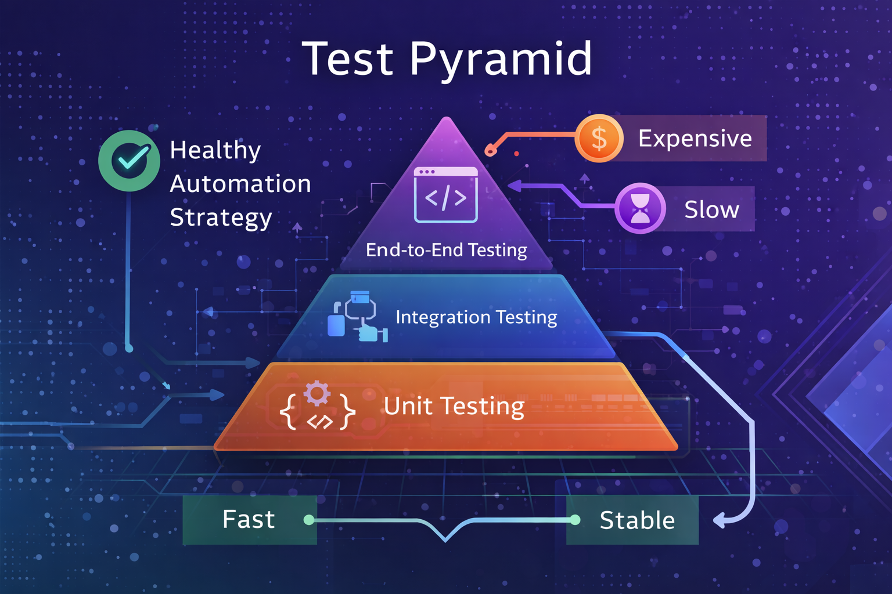

<p align="center">

</p>
# 🧪 Playground de Automação de Testes de QA


Repositório criado para estudar, documentar e demonstrar **práticas de Engenharia de Qualidade de Software e Automação de Testes**.

Este projeto combina **fundamentos teóricos** com **exemplos práticos de testes automatizados** utilizando ferramentas modernas de garantia da qualidade.

Repository created to study, document and demonstrate **Software Quality Engineering and Test Automation practices**.

This project combines **theoretical foundations** with **practical examples of automated testing** using modern QA tools.

---

# 🎯 Purpose of the Repository

The goal of this repository is to build a **QA Engineering portfolio** demonstrating:

- test automation strategies
- software testing architecture
- practical automation examples
- quality engineering concepts
- CI/CD testing integration

---

# 🧠 Topics Covered

This repository explores important areas of **Software Quality Engineering**:

- Test Automation Concepts
- Test Strategy
- Test Pyramid
- Automation Architecture
- End-to-End Testing
- Page Object Model
- Test Data Management
- Continuous Integration for Testing

---

# 📊 Test Pyramid

<p align="center">
  
</p>

The **Test Pyramid**, introduced by **Martin Fowler**, describes a balanced testing strategy.

| Layer | Focus |
|------|------|
| Unit Tests | Fast validation of business logic |
| Integration Tests | Component and API communication |
| End-to-End Tests | Validation of complete user flows |

A good automation strategy prioritizes **many fast tests at the base** and **fewer expensive UI tests at the top**.

---

# 🏗 Automation Architecture

The automation example in this repository follows practices used in professional QA teams:

- Page Object Model
- Reusable test components
- Externalized test data
- Clean folder structure

Benefits:

- better maintainability  
- improved readability  
- scalable automation suites  

---

# 📁 Repository Structure

```

qa-test-automation-playground
│
├── assets
│   ├── github-profile-banner.png
│   ├── qa-automation-side-panel.png
│   └── test-pyramid-diagram.png
│
├── architecture
│   └── automation-architecture.md
│
├── docs
│   ├── test-automation-concepts.md
│   └── test-pyramid.md
│
├── examples
│   └── cypress-demo
│
└── references
└── bibliography.md

```

---

# 🤖 Cypress Automation Example

This repository also includes a practical **Cypress automation project** used as an example of automated testing.

Application used for testing:

https://www.saucedemo.com

### Test scenarios implemented

- successful login
- invalid login
- UI validation
- error message validation

---

# 🧱 Cypress Project Structure

```

examples/cypress-demo
│
├── cypress
│   ├── e2e
│   │   └── login.cy.js
│   │
│   ├── fixtures
│   │   └── users.json
│   │
│   └── pages
│       └── LoginPage.js
│
├── cypress.config.js
└── package.json

````

This structure demonstrates a **clean automation architecture** commonly used in professional QA teams.

---

# 🧪 Example Automated Test

Example of login validation using Cypress:

```javascript
describe('Login Flow - SauceDemo', () => {

  it('should login successfully', () => {

    cy.visit('https://www.saucedemo.com')

    cy.get('[data-test="username"]').type('standard_user')
    cy.get('[data-test="password"]').type('secret_sauce')

    cy.get('[data-test="login-button"]').click()

    cy.url().should('include', 'inventory')

  })

})
````

---

# ⚙️ Technologies Used

| Technology     | Purpose               |
| -------------- | --------------------- |
| Cypress        | End-to-End automation |
| JavaScript     | Test scripting        |
| Git            | Version control       |
| GitHub         | Repository hosting    |
| GitHub Actions | CI/CD pipelines       |

---

# 📚 References

Concepts used in this repository are inspired by established **Software Engineering literature**:

* Martin Fowler — Test Pyramid
* Gerard Meszaros — xUnit Test Patterns
* Cem Kaner — Lessons Learned in Software Testing
* Robert Pressman — Software Engineering
* Jez Humble — Continuous Delivery

---

# 🚀 Future Improvements

Planned improvements for this repository:

* CI/CD pipelines executing automated tests
* API testing examples
* performance testing demonstrations
* advanced automation architecture
* test reporting dashboards

---

# 👩‍💻 Author

**Ivaneide Monteiro**

QA Automation Engineer focused on:

* Software Quality Engineering
* Test Automation
* QA Strategy
* CI/CD Testing

LinkedIn
[https://linkedin.com/in/ivaneidepmn](https://linkedin.com/in/ivaneidepmn)

---

⭐ This repository is part of my **QA Automation Engineering portfolio**.