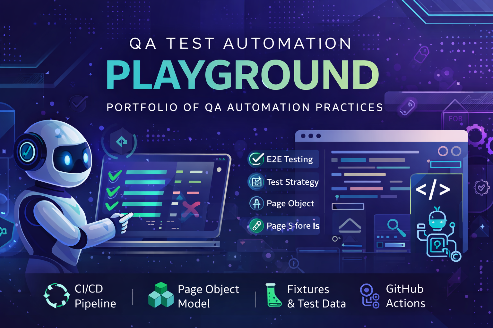
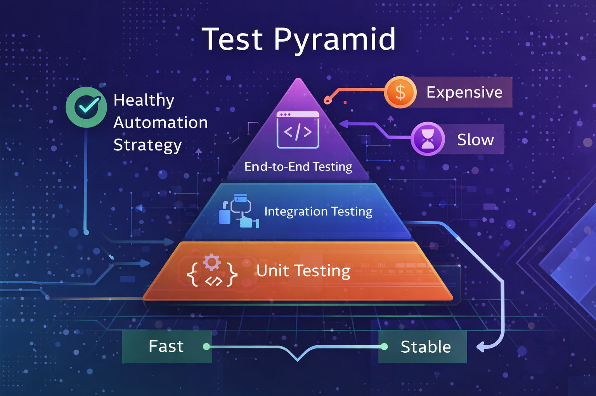
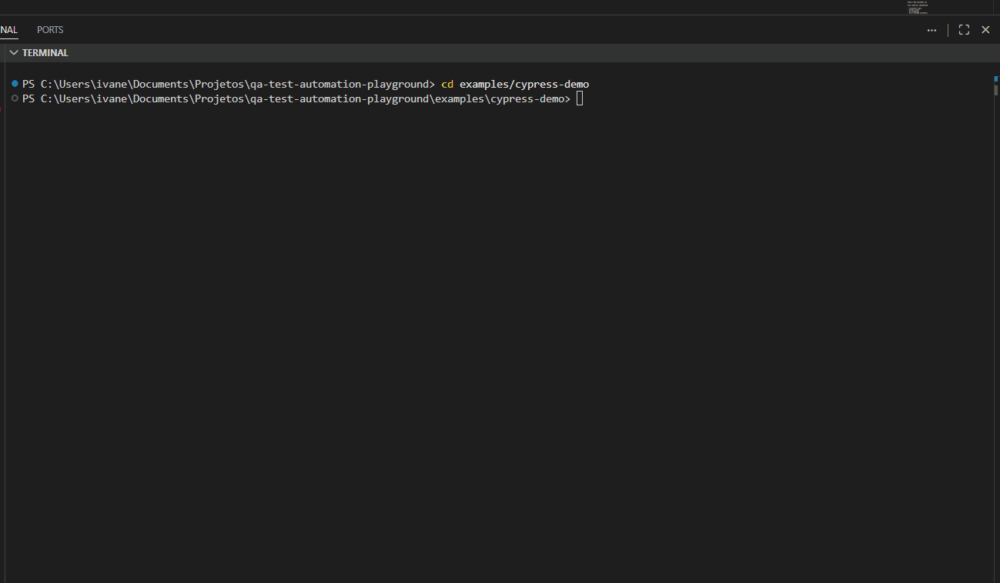

<p align="center">
  
  
  
  
  
</p>

<p align="center">

</p>

# 🧪 QA Test Automation Playgroundcd..

Repository created to **study, document and demonstrate Software Quality Engineering and Test Automation practices**.

This project combines **theoretical foundations of QA** with **practical automation examples using Cypress**, demonstrating how automated testing frameworks can be structured in real-world environments.

This repository is part of my **QA Automation Engineering portfolio**.

---

# 🎯 Purpose of the Repository

The goal of this repository is to demonstrate practical knowledge in **Quality Engineering and Test Automation**, including:

- Test automation strategies
- Software testing architecture
- End-to-End automation examples
- QA engineering concepts
- CI/CD integration for automated tests

---

# 🧠 Topics Covered

This repository explores important areas of **Software Quality Engineering**:

- Test Automation Concepts
- Test Strategy
- Test Pyramid
- Automation Architecture
- End-to-End Testing
- Page Object Model
- Test Data Management
- Continuous Integration for Testing

---

# 📊 Test Pyramid

<p align="center">
  
</p>

The **Test Pyramid**, introduced by **Martin Fowler**, describes a balanced test automation strategy.

| Layer | Focus |
|------|------|
| Unit Tests | Fast validation of business logic |
| Integration Tests | Validation of service and API communication |
| End-to-End Tests | Validation of complete user flows |

A good automation strategy prioritizes **many fast tests at the base** and **fewer expensive UI tests at the top**.

---

# 🏗 Automation Architecture

The automation approach used in this repository follows practices commonly adopted by professional QA teams.

Main architectural patterns used:

- Page Object Model
- Reusable test components
- Externalized test data
- Modular folder structure

Benefits:

- better maintainability
- improved readability
- scalable automation suites

### Additional framework improvements

- Custom Cypress commands for reusable actions
- Test Data Builder pattern
- Smoke and regression scenario tagging

---

# 📁 Repository Structure

```

qa-test-automation-playground
│
├── assets
│   ├── github-profile-banner.png
│   ├── qa-automation-side-panel.png
│   └── test-pyramid-diagram.png
│
├── architecture
│   └── automation-architecture.md
│
├── docs
│   ├── test-automation-concepts.md
│   └── test-pyramid.md
│
├── examples
│   └── cypress-demo
│
├── references
│   └── bibliography.md
│
└── README.md

```

---

# 🤖 Cypress Automation Example

The repository includes a **practical Cypress automation project** using the application:

https://www.saucedemo.com

Implemented test scenarios include:

- Successful login
- Invalid login validation
- UI element validation
- Error message validation

---

# 🎥 Test Execution Example

Example of Cypress tests running in the application.



---

# 📊 Test Coverage

Current automated scenarios implemented in the project.

### Authentication Tests

- Login with valid credentials
- Login with invalid credentials
- Login validation with empty fields
- Error message validation

### Inventory Tests

- Inventory page elements validation
- Product list rendering validation

### Cart Tests

- Add product to cart
- Remove product from cart

**Total automated scenarios: 7**

These scenarios validate the **core user flows of the application**.

---

# 🧠 Test Strategy

This project adopts an **End-to-End testing strategy** focusing on validating the main business flows.

Automation approach includes:

- End-to-End UI testing with Cypress
- Page Object Model architecture
- Test data management using fixtures
- Modular test architecture
- CI execution using GitHub Actions

---

# 🧩 Test Automation Architecture

```

qa-test-automation-playground
│
├── .github
│   └── workflows
│       └── cypress-tests.yml
│
├── assets
│   └── cypress-demo.gif
│
├── examples
│   └── cypress-demo
│       │
│       ├── cypress
│       │   │
│       │   ├── e2e
│       │   │   ├── login.cy.js
│       │   │   └── cart.cy.js
│       │   │
│       │   ├── fixtures
│       │   │   └── users.json
│       │   │
│       │   ├── pages
│       │   │   ├── LoginPage.js
│       │   │   ├── InventoryPage.js
│       │   │   └── CartPage.js
│       │   │
│       │   └── support
│       │       └── e2e.js
│       │
│       ├── cypress.config.js
│       ├── package.json
│       └── package-lock.json
│
└── README.md

````

This architecture improves:

- scalability
- maintainability
- readability
- CI pipeline integration

---

# 🔺 Real Test Pyramid in This Project

This project focuses primarily on **End-to-End functional testing**, validating the main user journeys.

| Layer | Description |
|------|-------------|
| E2E Tests | Validate login, inventory and cart flows |
| Page Objects | Encapsulate UI interactions |
| Fixtures | Store reusable test data |
| CI Pipeline | Executes automated tests |

---

# 📦 Example Automated Test

Example of login validation using Cypress.

```javascript
describe("Login Flow - SauceDemo", () => {

  it("should login successfully", () => {

    cy.visit("https://www.saucedemo.com")

    cy.get('[data-test="username"]').type("standard_user")
    cy.get('[data-test="password"]').type("secret_sauce")

    cy.get('[data-test="login-button"]').click()

    cy.url().should("include", "inventory")

  })

})
````

---

# ⚙️ Technologies Used

| Technology     | Purpose               |
| -------------- | --------------------- |
| Cypress        | End-to-End automation |
| JavaScript     | Test scripting        |
| Git            | Version control       |
| GitHub         | Repository hosting    |
| GitHub Actions | CI/CD pipelines       |

---

# 📚 References

Concepts used in this repository are inspired by established **Software Engineering literature**:

* Martin Fowler — Test Pyramid
* Gerard Meszaros — xUnit Test Patterns
* Cem Kaner — Lessons Learned in Software Testing
* Robert Pressman — Software Engineering
* Jez Humble — Continuous Delivery

---

# 🚀 Future Improvements

Planned improvements:

* CI/CD pipeline expansion
* API testing examples
* performance testing demonstrations
* advanced automation architecture
* test reporting dashboards

---

# 👩‍💻 Author

**Ivaneide Monteiro**

QA Automation Engineer focused on:

* Software Quality Engineering
* Test Automation
* QA Strategy
* CI/CD Testing

LinkedIn
[https://linkedin.com/in/ivaneidepmn](https://linkedin.com/in/ivaneidepmn)

---

⭐ This repository is part of my **QA Automation Engineering portfolio**.

